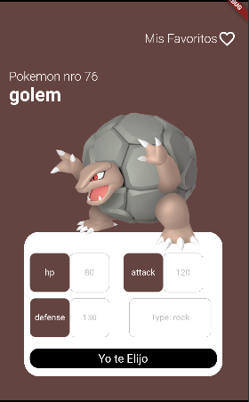
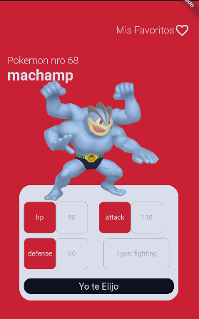
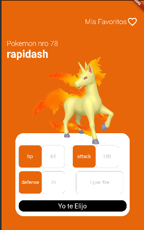
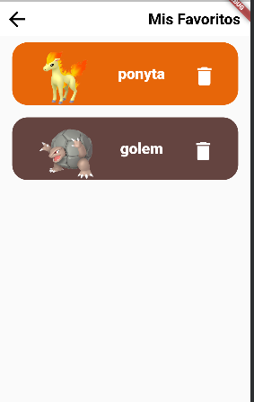
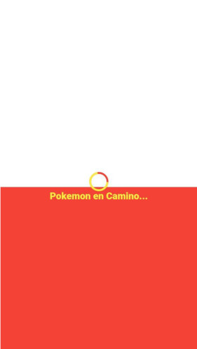

# tiktokemon
Challenge desarrollado para una empresa en su proceso de selección.

Start 29/06/2022 End: 13/07/2022

:exclamation: El soporte para Web y Desktop no funciona, pero en un futuro lo hará
## Versiones
- Flutter 3.0.0
- Dart 2.17.0
- DevTools 2.12.0

## Paquetes
- [http: 0.13.4](https://pub.dev/packages/http)
- [generic_bloc_provider: ^2.1.1](https://pub.dev/packages/generic_bloc_provider)
- [shared_preferences: ^2.0.15](https://pub.dev/packages/shared_preferences)
- [connectivity_plus: ^2.3.5](https://pub.dev/packages/connectivity_plus)

## ScreenShots de la Aplicacion
Puedes ver algunos screenshot de la Aplicacion Aqui

 

 

 